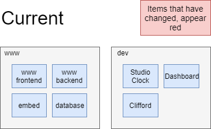

# Migration Plan

The current LA1TV website offering is a monolith application, there is no architectural separation of concerns between the components that form the website. This has lead to a situation where the website has been poorly maintained by the membership over the last 3 years and it has slowly become more and more of a risk to the continued operation of LA1TV.

The current site, however, is the most featureful out of any other student television station's and in its abilities rivals any broadcasting company's technological abilities except that of major broadcasters such as the BBC. This functionality is wanted to be maintained and improved upon with other features such as live blogging; reactions; more share features and improved onward journeys.

To achieve this without any major regression in capabilities a solution must be found to breaking down the monolith, something that has proved itself to be hard to achieve. Outlined below is a series of steps that could effectively decouple the frontend of the LA1TV website safely with no regression in capabilities on the backend, and only minor front end lose of functionality.

## Currently in the LA1TV Website

## Step 1

Duplicate the entire current stack into a new VM, served on a .api subdomain

## Step 2

In order to effectively develop the front end to a point where we are confident to overwrite www we must be able to see the development branch of the new front end in a live environment before its audience facing. The new www frontend can be developed and deployed against a dev environment talking to the api backend. This will give us confidence in the front ends abilities before switching off the current www frontend.

## Step 3

Once the new www frontend has been developed to a point where LA1TV is confident in its abilities, we can then deploy it over the top of the current www frontend, removing the old service from the view of the audience.

## Step 4

Once we have detached the audience from the old frontend, we can then remove that code from the backend service. removing a large part of the complexity exists on the current website.

## Post frontend migration

The frontend will now be isolated from the rest of the codebase, allowing LA1TV to actively start developing the frontend to suit their wants an needs rather than face the monolith that was the old website. The frontend can be built independently, using the latest in web design practises giving skills to members that they would not of been able to gain on the old stack. It can also be built simpler, having a much lower barrier to entry than the old php site.
